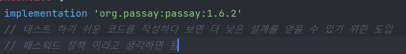

# TDD
Test Driven Development

* 프로덕션 코드보다 테스트 코드를 먼저 작성하는 개발 방법
* TDD 장점
1. 문서화 역할
2. 코드에 결함을 발견하기 용이
3. 리팩토링 시 안전성 확보 -> 코드가 복잡한
4. 테스트 하기 쉬운 코드를 작성하다 보면 더 낮은 결함도를 가진 설계를 얻을 수 있음

    @DisplayName("비밀번호가 8자 미만 또는 12자 초과하는 경우 IlleagalExpressionException 예외가 발생한다.")
    @ParameterizedTest()
    @ValueSource(strings = {"aabbcce", "aabbccddeeffg"})
    void validatePasswordTest2(String Password){ //위애서 정의한 valuesource가 paramete로 들어게 됨
        assertThatCode(()->PasswordValidator.validate(Password))
                .isInstanceOf(IllegalArgumentException.class).hasMessage("비밀번호는 최소 8자 이상 12자 이하여야 한다.");
    }
Passay를 사용하면 다음과 같이 테스트 코드의 ValueSource 에 Parameter를 사용할 수 있다.
